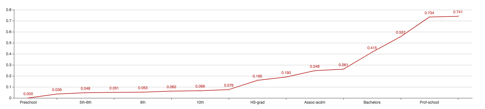
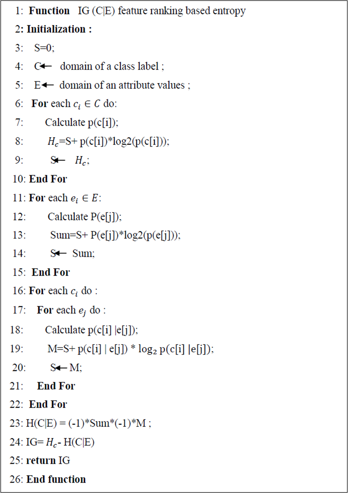
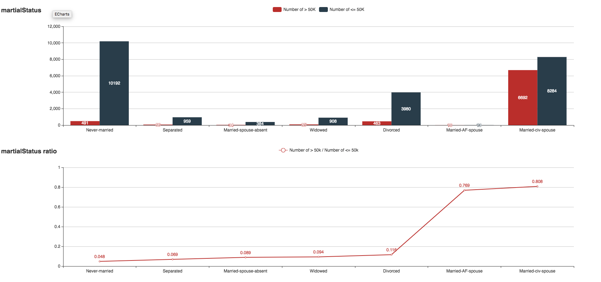
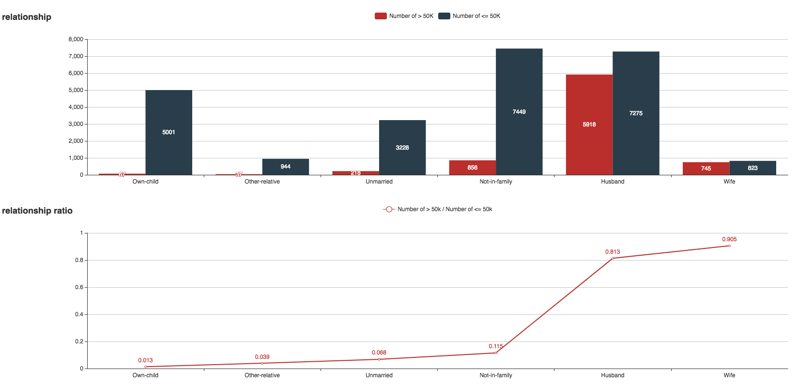
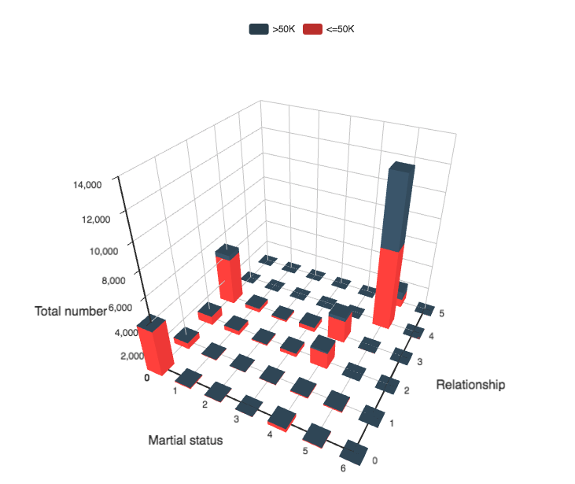
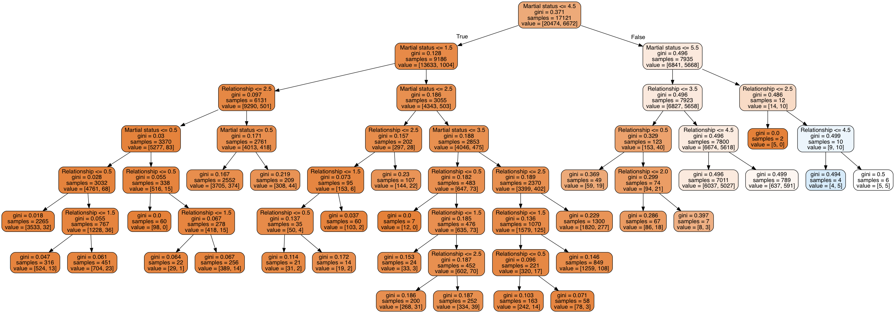

## Name convention

"HIR" = "High Income Ratio"

- For a specific feature, HIR represents (the number of who has income > 50K / total instance number of the feature value)
- For example, if we say the HIR of "Doctorate" is 0.67, it means for all doctors in the data set, 67% of the people's income is larger than 50K

## Quantize discrete data & Data overview

For textual described features, quantize the data to integers from 0 to 1 based on the following rule:

- The feature with **high quantized value** have **high HIR**

Take the feature "Education" for example. The feature values are sorted by the corresponding HIR in increased order 

```
'Preschool' => 0
'1st-4th' => 1 
'5th-6th' => 2
'11th' => 3
'9th' => 4
'7th-8th' => 5 
'10th' => 6
'12th' => 7
'HS-grad' => 8
'Some-college' => 9 
'Assoc-acdm' => 10
'Assoc-voc' => 11
'Bachelors' => 12 
'Masters' => 13
'Prof-school' => 14
'Doctorate' => 15
```



All features and their HIR are **visualized** at **https://zhengxiangyue.github.io/adult_income/map.html**

## Two features with highest information gain

Emmmm... Before take the real calculation, let's do some guesses. Intuitively, "Education" and "Occupation" seems two important features that influence one's income. We can tell from the "map.html" that higher degree of education do have higher HIR. But then let's take the real calculation.

For each feature, information gain is calculated using an entropy based method.

> ##### Feature Selection Using Information Gain for Improved Structural-Based Alert Correlation
>
> Taqwa Ahmed Alhaj , Maheyzah Md Siraj, Anazida Zainal, Huwaida Tagelsir Elshoush,Fatin Elhaj
>
> Published: November 28, 2016



The result is shown below(calculated in `information_gain.py`)

```
age => 0.06654272 
workclass => 0.01410503 
fnlwgt => 0.00049012 
education => 0.06813448 
education.num => 0.06393894 
marital.status => 0.11127446 <= The second highest information gain
occupation => 0.06532414 
relationship => 0.11389028 <= The first highest information gain
race => 0.01127807 
sex => 0.02677375 
capital.gain => 0.08571091 
capital.loss => 0.0354542
hours.per.week => 0.04578277 
native.country => 0.00812699
```

Wow, "**Relationship**" and "**Martial status**" own largest information gain ...

Kind of unexpected at first glance, but reasonable... Basically, being a husband or a wife means longer working experience and stronger economic basis. They are kind of like the result of "having higher income" rather than "the assumption of hiving higher income" such as education. So here are informations gain from the information gain:

- **Relationship and martial status** are two features with highest information gain, that is to say they have a stronger connection with income, compared to other features
- The following features include "capital.gain", "age", "education", "education.num", "occupation", coincident with our intuition.

The visualized data for relationship and martial status is shown:





## Soft-margin SVM based on two features

> The title of this part should really be named as "Fianlly I Know Why the Accuracy Is 75%"……

Use 10-fold validation and soft-margin SVM on the two-features data set, the accuracy is around 75%. It **"looks like the linear SVM works somehow not bad because it's better than guess(50%)"**. But when I tried other features and other combinations of features, the accuracy doesn't change much. I was shocked when I finally realized what the linear SVM is doing to my horrible non-linear separable dataset.

I go back to check the prediction result for each validation data. As expected, the linear SVM is doing a more horrible thing than randomly guessing: it predicts all data as "<=50K"

```
LIR = 22654(<=50K)/30162(total number) = 0.751077514754
```

Let's visualize how the SVM is predicting data for the two features, relationship and martial status. The feature value of "relationship" is quantized from 0 to 5, while "martial status" is from 0 to 6. All data locate on the 5 x 6 grid and where is the separating line? Where are the support vectors?

```
y = 0.0 / 0.0 x +1.0000000000000309 / 0.0
```

The data is shown(visit map.html for details):

 

The SVM gives meaningless boundary that predict all data as "<=50K" . In the 2D space, the boundary is parallel to y axis. 

So to solve the problem I may have two choices:

1. Find a better way to quantize the data so that linear SVM doesn't give up itself
2. Use non-linear classifier

Essentially, they are doing the same thing, especially when all features are considered.

## Random Forest

Since the data is non-linear separable. Intuitively, decision tree(random forest) seems a good solution for the dataset because:

- The feature number is not too large(14 features)
- There are many discrete features

Take two features we chose as input, use Gini information gain. The random forest is shown:



One problem is:

- For nearly all leaf node in the decision tree, the number of <=50K is always larger than the number of > 50K

So this tree has the same behavior as the linear SVM. It always(almost) predict data as "<=50K".

To solve this problem, we may use more features. When use all features,

```
TEST FOLD 0: 0.848856479947
TEST FOLD 1: 0.845210473981
TEST FOLD 2: 0.84449602122
TEST FOLD 3: 0.842175066313
TEST FOLD 4: 0.867705570292
TEST FOLD 5: 0.833885941645
TEST FOLD 6: 0.840848806366
TEST FOLD 7: 0.842838196286
TEST FOLD 8: 0.852122015915
TEST FOLD 9: 0.844164456233

```

[Image too large to show]

The result of 10-fold validation set is 0.84623030282